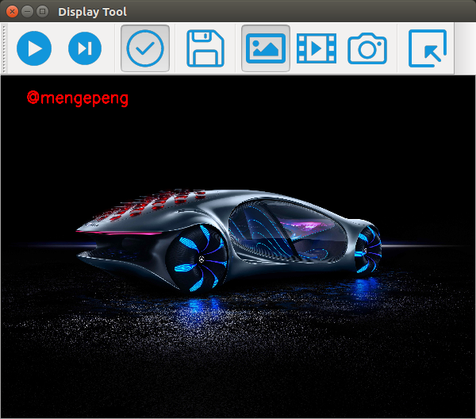

# display_gui

### Objective

#### A display tool for us to select and display local images or videos or live video from camera, it could be used for testing our image processing function and saving the processed image or video easily.

---

### Dependencies & Enviroment

* Python 3.6, wxPython 4.0.7, OpenCV 4.2
* OS: Ubuntu 16.04

### How to use the gui

1. Open the gui by running main.py.

2. Choose the corresponding audio-button for image, video or camera which you want to display.

3. Select resource files in the pop-up window by clicking the select-button.

4. Start or stop displaying by clicking the start-stop-button.

5. Process the current image or frame by clicking the enable-button.

6. Save the displayed image or video by clicking the save-button.

### The only thing you need to do

Change the code in [image_processing.py](./src/image_processing.py) for your image processing function.

---